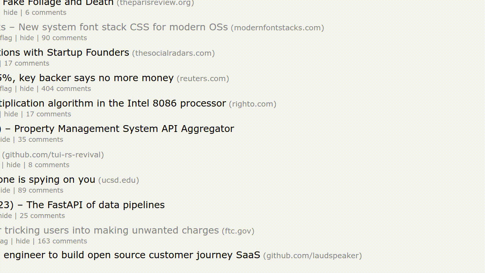

<h2>Want to integrate AI into Chrome? Try out my new project, <a href="https://chromewebstore.google.com/detail/aurora-instant-access-to/jodopikgpikacoinocjkddpogcccdmcl">Aurora</a></h2>

 

  <h1>GPT Anywhere</h1>
  
Use GPT anywhere with just one shortcut. Available for <b>Mac, Windows, and Linux</b>

# Usage

## Setup OpenAI API Key

1. If you don't already, sign up for an account with [OpenAI](https://platform.openai.com/)
2. Create an [API key](https://platform.openai.com/account/api-keys). 
3. Then, navigate to the settings page of GPT Anywhere using the tray icon. Or hit generate with a prompt and hit the "Open Settings" button
4. Finally, paste and save your API key.

## Open GPT Anywhere

Press `Ctrl-Shift-/` to toggle GPT Anywhere. 

**Note:** This will display above other windows you have open, so press the shortcut again to hide the window and interact with other applications.
